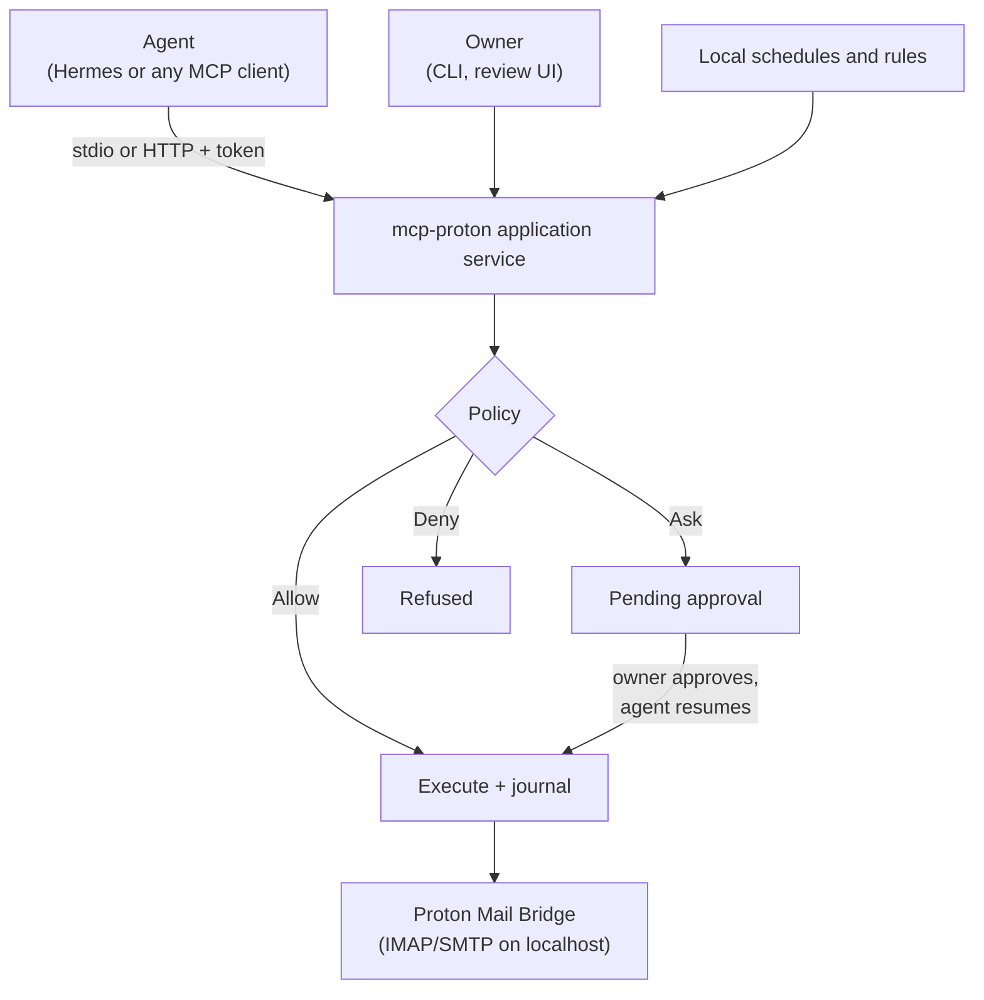

<p align="center">
  <picture>
    <source media="(prefers-color-scheme: dark)" srcset="docs/assets/banner-dark.svg">
    
  </picture>
</p>

<p align="center">
  <a href="https://github.com/w0h1v/mcp-proton/actions/workflows/ci.yml"></a>
  <a href="LICENSE"></a>
  
  <a href="https://modelcontextprotocol.io"></a>
  
  <a href="docs/compatibility.md"></a>
</p>

<p align="center">
  <a href="#quickstart">Quickstart</a> ·
  <a href="#autonomy-presets">Presets</a> ·
  <a href="#what-agents-can-do">Capabilities</a> ·
  <a href="#trust-boundaries">Security model</a> ·
  <a href="https://w0h1v.github.io/mcp-proton/">Docs</a> ·
  <a href="docs/roadmap.md">Roadmap</a>
</p>

**mcp-proton** is an [MCP](https://modelcontextprotocol.io) server that gives AI agents access to Proton Mail through [Proton Mail Bridge](https://proton.me/mail/bridge). You decide what each agent may do, per action: read, organize, draft, send or delete. Every operation goes through one policy engine, whether it comes from an MCP client, the CLI, the review UI or a scheduled job.

> [!IMPORTANT]
> **Alpha, unreleased.** Everything in the [design](docs/design.md) is implemented and tested against fake IMAP/SMTP servers. **Nothing has been verified against a real Proton Mail Bridge yet.** Every capability reports as `unverified` until the [compatibility probe](#compatibility) runs against a dedicated test account.

Independent project. Not affiliated with or endorsed by Proton AG.

## Highlights

- **Allow, Ask or Deny per action.** Pick a preset, then override it per client, account or mailbox. Grant temporary access that expires on its own.
- **Approvals bound to the exact request.** An approval covers specific recipients, content and messages. Change anything and it needs a new approval. The agent can't approve its own requests.
- **Honest about email.** Reading never marks mail read. Permanent deletion targets only the messages you named. If a send's outcome is unknown, it is never resent automatically.
- **Effects, not raw IMAP verbs.** Removing a label and destroying a message can be the same IMAP command. mcp-proton classifies operations by what they do in Proton's model, and refuses when that's not established.
- **Audit trail.** Every write is journaled with who asked, what policy decided and what happened, including partial results.
- **No AI calls, no telemetry.** The service talks only to Bridge and to the MCP client that asked.

## How it works



## Quickstart

**Requirements:** a paid Proton Mail plan that includes Bridge, with Bridge installed and signed in, and Python 3.11 or newer. macOS is the first development target. Linux and Windows are untested.

```sh
git clone https://github.com/w0h1v/mcp-proton && cd mcp-proton
uv venv && uv pip install -e .        # or: python -m venv .venv && pip install -e .
mcp-proton init                       # connect Bridge, pin its certificate, choose a preset
mcp-proton client-config hermes       # or: claude-desktop, generic
```

`mcp-proton init` walks through five steps:

1. **Connect Bridge.** Host and ports (default IMAP 1143, SMTP 1025), Bridge username and Bridge password. The password goes to the OS credential store. On headless systems use `--secret-ref env:VAR` or `--secret-ref file:/path` (mode 0600). There is no plaintext fallback.
2. **Trust Bridge's certificate.** Bridge uses a self-signed certificate. Setup shows its SHA-256 fingerprint and pins it after you confirm, or uses `--tls-ca-file` with Bridge's exported certificate.
3. **Choose an autonomy preset.** Until you choose one, every operation is denied.
4. **Choose storage mode.** `live` (default) keeps no copy of your mail. `metadata` and `index` keep a local cache for faster listing and full-text search.
5. **Print a client configuration** for your MCP client.

## Autonomy presets

| Preset | Reading | Organizing and drafts | Sending | Permanent deletion | Import, export, folder/label deletion, automation |
|---|:-:|:-:|:-:|:-:|:-:|
| **Reader** | ✅ Allow | ⛔ Deny | ⛔ Deny | ⛔ Deny | ⛔ Deny |
| **Assistant** | ✅ Allow | ✅ Allow | ✋ Ask | ✋ Ask | ✋ Ask |
| **Autonomous** | ✅ Allow | ✅ Allow | ✅ Allow | ✅ Allow | ✅ Allow |
| **Custom** | your choice | your choice | your choice | your choice | your choice |

- **Ask** records the request and returns `approval_pending`. It runs after you approve it (`mcp-proton approvals approve <id>` or the review UI) and the agent calls `operations_resume`.
- **Overrides:** `mcp-proton policy set send deny --client hermes`. **Temporary grants:** `mcp-proton policy grant send --minutes 30`.
- **Limits on top of any preset:** allowed accounts and mailboxes, allowed recipients or domains, batch size, sends per day, and which folders agents may read attachments from or export to. See `mcp-proton policy constraints set --help`.
- **See what applies and why:** `mcp-proton policy show --client hermes --account personal`.

> [!WARNING]
> **Autonomous mode:** an agent that reads untrusted email can be manipulated by that email into sending or exporting information. Consider a recipient restriction (`--allowed-recipients @yourdomain.com`) alongside it.

## Connect an MCP client

**Local stdio** (simplest; Hermes and most desktop clients). The client launches `mcp-proton serve --transport stdio` with `MCP_PROTON_CLIENT_ID` set. That ID is a label for organizing policy, not authentication: any process running as your OS user can claim it.

**Authenticated HTTP** (several clients, or agents on another machine through a tunnel):

```sh
mcp-proton clients add hermes --http-token     # prints a bearer token once
mcp-proton serve --transport http              # binds 127.0.0.1:8765 by default
```

Each token maps to one client identity. `mcp-proton clients revoke hermes` takes effect on that client's next request.

## What agents can do

| Area | Tools | Notes |
|---|---|---|
| Accounts | `accounts_list`, `accounts_health`, `accounts_capabilities` | Capability report per connected Bridge |
| Mailboxes and labels | `mailboxes_*`, `labels_*` | Folders, labels, subscriptions, empty Trash/Spam from a snapshot |
| Reading and search | `messages_list`, `messages_get`, `messages_search`, `conversations_get` | Reading never sets `\Seen` |
| Organizing | `messages_set_flags`, `messages_move`, `_archive`, `_trash`, `_restore`, `_mark_spam`, `_not_spam` | Per-item results, no false atomicity |
| Deletion | `messages_mark_deleted`, `messages_expunge` | Trash/Spam only, targeted UIDs only |
| Drafts and sending | `drafts_*`, `mail_send`, `mail_reply`, `mail_forward`, `mail_reconcile` | Stable Message-ID; `delivery_unknown` is never resent |
| Attachments | `attachments_*`, `exports_attachment` | Size limits, owner-configured folders only |
| Import and export | `imports_eml`, `imports_mbox`, `exports_messages` | Resumable manifests, duplicate skipping |
| Change tracking | `events_*` | IDLE plus polling; events carry no subjects or bodies |
| Approvals | `operations_status`, `operations_resume`, `operations_cancel`, `operations_undo` | Caller-scoped |
| Local automation | `jobs_*`, `rules_*`, `webhooks_*` | Needs `mcp-proton serve` running |
| Local index | `search_local`, `stats_get`, `saved_searches_*` | Non-`live` storage modes |

Resources expose capability reports, mailbox lists, operation status and message content under opaque `proton://` URIs, with the same policy checks as tools.

<details>
<summary><strong>Behaviour worth knowing</strong></summary>

- Message handles are opaque and include the mailbox's UIDVALIDITY, so a stale handle fails instead of acting on the wrong message.
- Proton labels appear as mailboxes under `Labels/`. Adding a label copies into that mailbox; removing it removes only that occurrence. Operations whose effect on Proton's model isn't established return `unsupported_semantics` instead of guessing.
- Permanent deletion never runs a bare `EXPUNGE`. Emptying Trash uses a snapshot, so mail that arrives during the operation is kept.
- A successful send means Bridge accepted the message, not that recipients received it. If the connection drops after the message was handed over, the result is `delivery_unknown`. `mail_reconcile` looks for it in Sent; not finding it there doesn't prove it wasn't delivered.
- Scheduled sends, reminders, snooze and filing rules are **local automation**. They need mcp-proton running on this machine. They are not Proton's native scheduled send or server-side filters.
- Outside Bridge, not available: native scheduled-send management, contacts, calendar, server-side filters, address provisioning and key management.

</details>

## Trust boundaries

| Deployment | Who runs what | What policy protects |
|---|---|---|
| **Personal local** | Agent and mcp-proton share one OS user | Calls made through mcp-proton. An agent with unrestricted shell or file access can edit the policy or talk to Bridge directly. Fine for trusted personal agents. |
| **Isolated service** | mcp-proton, credentials, policy and review UI run as a separate OS user; agents connect over authenticated HTTP | Agents can't reach the policy, credentials or Bridge. See [docs/deployment.md](docs/deployment.md). |

Neither the transport nor an approval prompt proves isolation by itself.

### Where your email goes

mcp-proton makes no AI calls and sends mail content only to the MCP client that asked for it. What the agent does with it is outside mcp-proton's control: if your agent uses a hosted model, email content reaches that provider and may persist in transcripts or logs. Bridge keeps its own local cache. To limit what this service releases, set `release_bodies = false` or `release_attachments = false` in the policy constraints.

Even in `live` mode, mcp-proton keeps operational records: the operation journal (including the full content of requests awaiting approval), change events (no subjects, addresses or bodies), mailbox state snapshots, jobs and managed attachment copies. See [docs/storage.md](docs/storage.md). `mcp-proton purge` applies retention.

## Owner tools

```sh
mcp-proton approvals list | show <id> | approve <id> [--execute] | deny <id>
mcp-proton activity                    # what happened, including partial results
mcp-proton pause <account>             # stop all access to an account now
mcp-proton clients revoke <id>
mcp-proton ui-token && mcp-proton ui   # local review UI on 127.0.0.1:8766
mcp-proton diagnostics --json          # metadata only; safe for bug reports
```

## Compatibility

Each capability reports `available`, `unavailable` or `unverified` for the connected Bridge (`accounts_capabilities`). It becomes `available` only with recorded evidence for that Bridge version.

To produce evidence, run the probe against a **dedicated test account**, never your personal mailbox:

```sh
mcp-proton probe test-account --yes-dedicated-test-account --send-to you@example.com --out report.json
# review report.json, then:
mcp-proton probe test-account --yes-dedicated-test-account --record
```

The probe creates its own folders, label and synthetic messages, records how Bridge actually behaves (label semantics, expunge outside Trash, Sent filing, imported dates and more), and cleans up. Rerun it after Bridge updates. Found a difference? Open a [compatibility report](https://github.com/w0h1v/mcp-proton/issues/new?template=compatibility_report.yml). See [docs/compatibility.md](docs/compatibility.md).

## Contributing

Contributions are welcome; start with [CONTRIBUTING.md](CONTRIBUTING.md). Tests run against fake IMAP (pymap) and SMTP (aiosmtpd) servers, so they don't need a Proton account, but they're not Bridge evidence. Live tests are opt-in: `MCP_PROTON_LIVE=1 MCP_PROTON_LIVE_ACCOUNT=<name> pytest -m live`.

- [Design](docs/design.md) · [Roadmap](docs/roadmap.md) · [Changelog](CHANGELOG.md)
- Questions and help: [SUPPORT](.github/SUPPORT.md)
- Security reports: [SECURITY.md](SECURITY.md) (private advisories, never public issues)

## License

[Apache License 2.0](LICENSE). See [NOTICE](NOTICE). "Proton" and "Proton Mail" are trademarks of Proton AG.
