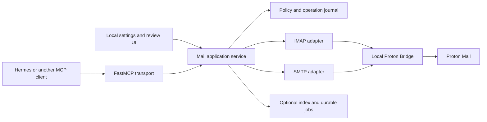

# mcp-proton — design proposal

2026-10-09. Project name: **mcp-proton**. Original implementation, with Mailpouch used only as a feature reference. Status: design, not implemented or verified against a live mailbox.

Naming conventions: repository, distribution, and CLI command `mcp-proton`; Python package `mcp_proton`. An independent project for Proton Mail Bridge.

Intended distribution: open source. This revision incorporates the Opus 5.5 design review (not included in this repository). Reviewer source observations are inputs to compatibility testing, not substitutes for live verification. Delivery is phased; the complete Bridge inventory remains the product target.

## Product contract

Give any MCP agent comprehensive access to the mail operations Proton Bridge supports. Let the owner choose autonomy, scope, and persistence. Support Hermes and local model agents through the same interface. The mail service requires no model or external AI provider of its own.

Completeness means maintaining a capability inventory and testing every supported operation against Bridge. A feature is reported as available, unavailable, or unverified for the connected Bridge version. Protocol extensions are detected at runtime; their existence in IMAP standards does not establish Bridge support.

## Architecture

Python application with explicit modules: `domain`, `bridge`, `services`, `policy`, `storage`, `jobs`, `mcp`, and `admin`. Typed request/result models and one application service shared by MCP, CLI, and UI. Keep authorization inside that service so alternate entry points cannot bypass the chosen policy.

Start with one process and a bounded connection pool per account. Serialize operations using the same selected IMAP connection; reserve a separate connection for IDLE where supported. Reconnect and rediscover capabilities after Bridge restart. Use standard MIME handling and a maintained IMAP/SMTP library selected through a small compatibility spike; no commitment to an untested library yet.

Local stdio is the simplest Hermes integration. Optional authenticated HTTP enables multiple clients and remote agents while Bridge remains on its local host. An always-running service is required for schedules and continuous watching; a stdio subprocess alone stops when its host exits. A thin stdio connector can reach that service when needed.

Support two explicitly documented deployment models:

- **Personal local deployment:** the agent and service share an OS user. Application policy governs calls through mcp-proton; an agent with unrestricted shell/file access may bypass it by changing configuration or accessing Bridge directly. This is convenient for trusted personal agents, including Autonomous mode.
- **Isolated service deployment:** the service, credentials, policy files, and owner approval interface are outside the agent's OS permissions. Agents use authenticated HTTP with scoped credentials. Separate users alone are insufficient if the agent can still obtain Bridge credentials, reach unprotected admin endpoints, or elevate privileges. Phase 0 validates the actual isolation and network boundaries. Authentication, owner-only administration, and browser origin/CSRF protections apply to the review interface.

Neither transport nor an approval dialog proves isolation by itself. Choose the deployment according to the user's desired boundary; isolation is optional, not a prerequisite for using the product.

## User control

Every operation family has **Allow**, **Ask**, or **Deny**. Allow executes without confirmation. Ask obtains a decision through the configured review channel. Deny does not execute. Settings can vary by configured client identity, account, and mailbox. The effective setting and its source are visible before use.

Presets are editable starting points:

| Preset | Reading | Organizing and drafts | Sending | Permanent deletion |
|---|---|---|---|---|
| Reader | Allow | Deny | Deny | Deny |
| Assistant | Allow | Allow | Ask | Ask |
| Autonomous | Allow | Allow | Allow | Allow |
| Custom | Owner choice | Owner choice | Owner choice | Owner choice |

Onboarding offers all presets directly. Optional controls include recipient/domain restrictions, account and folder scope, attachment import/export directories, maximum batch size, send limits, and temporary grants. No hidden application quota in Autonomous; provider and technical limits still apply. Policy editing is an owner administration capability, separate from ordinary mail tools. Autonomous onboarding briefly explains that an agent reading untrusted email can be manipulated into sending or exporting information; optional recipient restrictions are available alongside the preset.

The four columns above summarize ordinary mail behavior. Separate settings cover local attachment ingestion, attachment/message export, mail import, folder deletion, label deletion, and automation registration. Reader denies these additional operations; Assistant asks for them; Autonomous allows them within owner-configured account and filesystem scope. Draft attachment access still checks local-file permission. Bridge folder creation and label application belong to organizing. Folder/label deletion checks both its own family and any resulting message-deletion effects.

Policy resolution is explicit: an owner-selected preset supplies the baseline; the most specific owner-configured client/account/mailbox action override replaces the inherited action. If matching rules have equal specificity, Deny wins over Ask over Allow. Independent scope boundaries and recipient/path constraints are intersected and cannot be broadened by an action override. For operations affecting multiple scopes, every source and destination must pass; any Deny rejects, otherwise any Ask requires review. Owners can intentionally broaden permissions by editing the relevant boundary. New or unclassified operation families remain unavailable until included in a reviewed preset or explicitly configured; this does not impose approvals on known operations in Autonomous.

Classify permissions by expected effects, not raw IMAP verbs. A label removal, draft replacement, folder deletion, and message destruction can share low-level commands but require different domain decisions. Build a tested effect table for each mailbox type and operation. Recheck relevant state at execution; if effects differ from an approved plan, invalidate it. Unknown effects return `unsupported_semantics` rather than silently escalating impact, even in Allow mode.

Ask binds the decision to the exact account, action, message set, recipients, content digest, and expiry. Changing the request requires a new decision. A client-supplied `confirmed=true` is not approval. MCP elicitation can serve as the review channel for a client the owner trusts to collect user input; it does not prove human involvement by itself. An independent local UI is available for users who want that boundary. Unsupported clients receive an approval-pending result and can resume after review. Users who want unattended execution select Allow.

Approval protocol: a write returns `{status: "approval_pending", operation_id, expires_at, summary}`. `operations_status(operation_id)` reads a caller-scoped record; `operations_resume(operation_id)` executes the stored payload after approval, without accepting replacement arguments. Owner CLI approval ships before the UI. Default approval lifetime is 15 minutes and is owner-configurable. States are pending, approved, denied, expired, executing, succeeded, partially_succeeded, failed, cancelled, or delivery_unknown. The journal atomically claims execution to prevent duplicate resumes; approval consumption and execution results are durable. Expired decisions, changed payloads, stale message handles, or changed effects require a fresh plan. Policy is rechecked when resuming, so revocation takes effect immediately. Neither operation IDs nor client labels grant approval authority.

Local stdio inherits the OS user's trust. A configured client label helps organization but is not strong authentication against another process running as the same user. HTTP permissions bind to authenticated identities, not self-reported MCP client names. Strong isolation requires separate OS identities or deployment boundaries.

## Bridge capability inventory

The following is the implementation and verification scope, not a claim that all rows already work. [Proton describes Bridge as an IMAP/SMTP interface with import, export, and search](https://proton.me/support/imap-smtp-and-pop3-setup). Each row requires a real Bridge acceptance case.

| Area | Planned functionality | Semantics and verification |
|---|---|---|
| Connection | Configure multiple accounts; health, reconnect, capability diagnostics | Bridge credentials and ports; record tested Bridge version; combined/split address modes |
| Mailboxes | List hierarchy, special folders, counts, unread counts, subscriptions | Discover delimiter and attributes; verify subscription behavior and writable flags |
| Reading | Paged listings; full message; selected headers; plain/HTML body; raw RFC822 | Fetch with PEEK so reading does not implicitly mark seen; explicit option to mark read |
| Search | Sender/recipient, subject, date, size, flags, headers, body/text, boolean combinations | Structured query translated to supported IMAP SEARCH; disclose fallback and scope; return completeness as unknown when Bridge synchronization cannot be established |
| Attachments | List metadata; fetch bytes; export; attach files; inline CID parts | Bounded streaming where possible; explicit managed artifact handles; avoid arbitrary paths |
| Flags | Read/unread, star/unstar; other flags accepted by the mailbox | Respect PERMANENTFLAGS; custom client tags are not Proton labels |
| Filing | Move, copy, archive, trash, restore, spam, not-spam | Special folders discovered; moving to Spam does not promise sender blocking or filter creation |
| Labels | List/create/rename/delete; apply/remove; bulk changes | Labels appear as mailboxes; implement Proton's documented move/copy behavior without disturbing other memberships |
| Folders | Create nested folders, rename/move hierarchy where accepted, delete | Protect system folder semantics; report effects on contained messages; verify server constraints |
| Drafts | Create, read, update, discard, send; recipients, attachments, reply headers | IMAP append/replacement semantics; conflict detection and returned new handles; avoid duplicate drafts |
| Outgoing mail | Compose, reply, reply-all, forward inline or as attachment; To/Cc/Bcc; plain/HTML; Reply-To | MIME and SMTP; configured sender identities; correct envelope/Bcc handling and threading headers |
| Deletion | Mark deleted, clear deletion flag where possible, targeted permanent deletion, empty trash | Distinguish trash from expunge; verify UID EXPUNGE; never silently expunge unrelated flagged messages |
| Bulk actions | All applicable read and mutation operations over explicit message sets | Snapshot targets, preview, progress, cancellation between items, partial results; no false atomicity |
| Import/export | Client-side EML and mbox import/export; preserve original message metadata where supported | IMAP APPEND and raw fetch; duplicate handling and resumable manifests; test INTERNALDATE and recovery-folder behavior; no cross-account move atomicity |
| Change tracking | New mail, changed flags, changed memberships, deletions | IDLE watches one selected mailbox per connection; bounded polling for other mailboxes; resync on UIDVALIDITY changes; no assumed webhooks |
| Extended protocol | Use advertised UIDPLUS, MOVE, IDLE and other verified extensions | Plan without CONDSTORE/QRESYNC, SORT/THREAD, QUOTA or NAMESPACE; detect future support without making core behavior depend on it |

[Proton's label documentation](https://proton.me/support/labels-in-bridge) is the semantic reference for label operations. [Folder creation guidance](https://proton.me/support/this-computer-only-folder-outlook) and [Bridge release notes](https://proton.me/download/bridge/stable_releases.html) inform compatibility tests. Label colors, account settings, and other properties absent from IMAP are not inferred from mailbox names.

The reviewer observed limited extensions in Gluon source and mailbox-dependent move/expunge behavior in Bridge, including a feature-flag branch. These observations require version-pinned source inspection and live acceptance tests before becoming adapter guarantees. Record test date, relevant Bridge settings, and observed behavior as well as version. Configuration or server-side behavior changes can invalidate earlier evidence.

Without incremental flag synchronization, reconcile watched mailbox UID/flag sets on a configurable schedule. Poll label memberships separately; do not create one idle connection per label by default. Expose watch scope, polling interval, scan cost, last reconciliation time, and freshness. Benchmark a large fixture with many labels and establish a tested connection budget in Phase 0. All Mail and Scheduled visibility are discovered from the connected configuration; scheduled-message visibility does not grant native scheduling management.

## Features built by our service

These use Bridge operations but keep their own application state:

- Conversation grouping from Message-ID, References, and In-Reply-To, with documented fallback and incomplete-thread indicators. Do not promise exact Proton conversation matching.
- Optional full-text index, saved searches, message statistics, and attachment text extraction. Semantic search can be added with an explicitly selected embedding provider.
- Local send schedules: create, list, edit, cancel, run status, timezone handling, missed-run policy. Persist immutable outgoing content or detect a changed referenced draft. Machine and service must be available to send.
- Local reminders and snooze-like filing/restoration, clearly labeled as local automation. Proton's native snooze is [limited to its web/mobile apps](https://proton.me/support/snooze-emails).
- Local rules for filing and flagging, with preview, execution history, and optional triggers. They do not edit Proton's server-side filters.
- Change event journal and polling cursor for agents; optional explicitly configured webhook destinations. Notifications are hints; clients can catch up after disconnect.
- Best-effort undo for reversible operations, using recorded prior state. Sending and permanent deletion have no general undo.

Native scheduled-send management is not promised through IMAP/SMTP. Visibility of scheduled messages, if exposed by Bridge, is distinct from creating or cancelling a Proton schedule. Contacts, Calendar, Drive, Pass, alias provisioning, account security, server filters, remote-content preferences, and encryption-key administration are outside Bridge. Existing sender addresses can be used subject to account permissions; provisioning new ones is separate. [External PGP configuration remains a Proton-side concern](https://proton.me/support/sending-pgp-emails-bridge).

## FastMCP foundation

As checked on 2026-10-09, GitHub and PyPI both report **FastMCP 4.1.0**, released 2026-10-08. Use the standalone `fastmcp` package, with an exact tested lockfile and deliberate upgrades. It is a framework built on the MCP Python SDK; do not confuse it with the older SDK-bundled FastMCP API. [Release](https://github.com/PrefectHQ/fastmcp/releases/tag/v4.1.0), [current overview](https://gofastmcp.com/getting-started/whats-new).

- Typed tools and structured results; descriptive read-only, destructive, and idempotency annotations. Annotations describe behavior; policy enforces permissions.
- Resources for capability reports, mailbox metadata, operation status, and selected message content. Resource reads use the same policy and identity checks as tools.
- Optional prompts for triage, reply drafting, and inbox review. Email content remains untrusted data; prompts cannot guarantee protection from injection.
- Group tools by mail domain using composition/providers. Keep individual operations discoverable; optionally use tool search for clients with large catalogs. Basic clients still get usable ordinary tools.
- For authenticated HTTP, framework authorization filters visibility and checks calls. Do not rely on these checks for stdio: the domain service enforces configured local policy on every entry point, independently of transport authentication. [Authorization](https://gofastmcp.com/servers/authorization).
- Elicitation and MCP Apps can improve selected Ask workflows. Compatibility fallback is the local approval queue. Interactive tools may restart from the top, so perform side effects only after resolving the operation record. [Elicitation](https://gofastmcp.com/servers/elicitation).
- Test legacy elicitation and modern input-response flows separately. Record Hermes's negotiated protocol, timeout behavior, and whether the configured approval surface reaches the owner; do not infer human review from an accepted protocol response. An unattended client using Ask retains a pending operation until an authorized reviewer responds or it expires.
- Use lifespan management for connections and shutdown, progress/cancellation for long jobs, and bounded structured errors.
- Optional `fastmcp-tasks` support for capable clients, with ordinary job IDs and status/cancel tools for others. Durable local mail scheduling belongs to the application job store, independent of an MCP session. [Background tasks](https://gofastmcp.com/servers/tasks).
- Framework user session state requires authenticated identity. Durable mail state is keyed by our account and operation identities, not a transport session. Disable framework response caching for mail content initially. Resource URIs contain opaque identifiers, not subjects or addresses; omit mail arguments from routing headers and message bodies from telemetry. Background task arguments reference authorized operation IDs instead of carrying mail bodies or credentials; inspect and protect any task backend's persisted data before enabling it.
- Test both current protocol behavior and the actual installed Hermes client. Features such as Apps, tasks, resources, and elicitation are negotiated; do not assume Hermes supports every extension.

Suggested tool families: `accounts_*`, `mailboxes_*`, `messages_*`, `attachments_*`, `labels_*`, `drafts_*`, `mail_send/reply/forward`, `imports_*`, `exports_*`, `jobs_*`, and `events_*`. Each tool has a narrow typed schema, account scope, bounded pagination, and machine-readable outcomes. Owner configuration remains in CLI/UI administration.

## Reliability and data handling

Message handles include account, mailbox identity, UIDVALIDITY, and UID. Message-ID alone is neither unique nor a mutation locator. Moves and draft replacements return replacement handles. Detect stale handles, mailbox renames, and concurrent edits; never fall back to sequence numbers for delayed operations.

Separate a mailbox occurrence from a logical message, because folders, labels, and All Mail may expose the same message through different UIDs. Investigate a stable Bridge-exposed identity in Phase 0. If unavailable, heuristic grouping is labeled uncertain and is used only for presentation; ambiguous matches never merge destructive targets. Bulk previews show occurrences and known unique messages separately. UIDVALIDITY changes invalidate pending mutation targets and approvals; re-resolution produces a new plan for review when the policy is Ask.

Writes receive operation IDs and a small durable journal. Deduplicate retried operations where possible. SMTP may accept a message before the connection fails: return `delivery_unknown` and reconcile instead of automatically resending. Exactly-once SMTP delivery is not promised. Sending success means server acceptance, not recipient delivery. Generate one stable Message-ID per outgoing operation, preserve it across retries, and use Sent search as reconciliation evidence; absence from Sent does not prove non-delivery. Do not append a Sent copy after SMTP; verify Bridge's automatic Sent handling. Record recipient-level acceptance and never retry already accepted recipients implicitly.

Draft replacement appends and verifies the new draft before removing the old occurrence. Journal both handles and report partial replacement if cleanup fails. Sending a draft has a separately tested cleanup step; do not assume SMTP removes the original. Recovered-message handling and original-date preservation are explicit import test cases. Trash is reversible only while the message still exists; provider retention settings may remove it later.

Bulk results report succeeded, failed, skipped, and pending items. Cancellation stops remaining work, not completed changes. Scheduled operations recheck current policy at execution. Approved operations retain the exact approved payload; edits invalidate approval. Empty-folder operations use an explicit snapshot so later-arriving mail is not silently included.

Credentials use the OS credential store with an explicit alternative secret provider for headless systems. Bridge certificate trust is configured during setup and verified thereafter. No silent plaintext credential fallback. MIME/HTML rendering is sanitized and remote assets are not fetched automatically. Files are managed through scoped imports/exports, with filename/path validation and size limits.

Offer three persistence choices: live access with no retained message cache; metadata cache; or full local searchable index. Operational records still exist for requested durable jobs, pending approvals, and retry reconciliation, and this is disclosed separately. Provide retention, purge, export, and storage-size controls. Optional encryption at rest must cover bodies, attachments, database journals, and backups; indexing encrypted storage needs a deliberate implementation choice.

These modes describe mcp-proton storage only. Bridge maintains its own cache, and agents may retain email in transcripts, memory, or external provider logs. The first release supports live access plus necessary operational records; additional cache modes arrive in later phases. Document the contents and retention of operational records, including any payload needed for a pending approval, rather than describing this as zero persistence.

The service itself makes no AI calls by default. A local connection does not constrain what the agent does with returned content. Describe whether the user's configured agent processes email locally or remotely without claiming the mail server can enforce downstream privacy. Optional body/attachment restrictions control what this service releases.

## User experience

Setup: connect Bridge, test connection/certificate, select accounts, choose an autonomy preset, choose storage mode, then export a client configuration. Advanced constraints remain optional.

The eventual local UI has Accounts, Agent Access, Activity, Pending Reviews, Jobs, and Storage. Activity explains completed and partial operations. Pending Reviews shows exact recipients/content or deletion targets with approve, reject, and edit-through-new-request actions. An owner can pause an account or revoke a client immediately. Users choosing Autonomous do not encounter routine approval prompts. Early releases provide setup, policy inspection, approval, revocation, and activity through the CLI; the UI uses those same application services when introduced.

## Phased delivery and acceptance

Phases control release order, not the long-term feature commitment. All start as planned; no phase is complete. An early public alpha is useful without claiming full Bridge coverage. Version 1.0 targets the complete verified Bridge operation layer, independently of optional automation and indexing.

| Phase | Deliverable | Exit evidence |
|---|---|---|
| 0 — Foundation and compatibility | Project skeleton, pinned dependencies, typed domain contracts, policy engine, operation journal, owner CLI skeleton, isolated-deployment design, and disposable mailbox spike | Actual capabilities/flags and address modes; effect table for moves, expunge and folder/label deletion; identity strategy; Sent/draft/SMTP/import probes; Hermes protocol and approval checks; polling/connection budget |
| 1 — Public alpha | Local stdio plus one documented authenticated HTTP deployment; reading/search, attachment retrieval and scoped ingestion, flags, filing, labels, folder creation, drafts and sending/replies; all presets; CLI approvals and status/resume; live-access storage | Every exposed tool passes domain policy and operation-journal tests; key Bridge round trips; no duplicate send on replay; unknown delivery handling; reproducible install and synthetic CI; explicit supported/unsupported matrix |
| 2 — Complete Bridge beta | Remaining folder/label management and deletion, targeted expunge, bulk operations, EML/mbox import/export, subscriptions where supported, complete attachment/MIME handling, multi-account/address edge cases, change tracking and conversation presentation | Every inventory row implemented and verified, explicitly unsupported with evidence, or documented as a release blocker; membership/identity tests; interrupted and concurrent-operation recovery; large-mailbox measurements |
| 3 — Stable 1.0 | Hardened complete Bridge layer, local administration/review UI, packaging, upgrade/migration path, documentation and release artifacts | No unexplained inventory gaps; declared OS/client support backed by tests; independent security/reliability review of implementation; clean install/upgrade/uninstall; tested deployment boundaries and release rollback guidance |
| 4 — Optional automation | Durable schedules, reminders, local rules, event consumers/webhooks, and best-effort undo | Restart and missed-run recovery; policy rechecks; scoped event delivery; explicit irreversible-operation limits; feature-specific acceptance cases |
| 5 — Optional search/storage expansion | Metadata/full-text caching, saved searches, statistics, attachment extraction, optional semantic search and encryption-at-rest modes | Retention and purge verification, indexing correctness, privacy documentation, data migrations, storage/performance measurements and provider opt-in |

Phase 0 establishes policy before any exposed mutation tool. Before onboarding chooses a preset, account access is denied. After selection, that preset operates exactly as documented, including unattended writes in Autonomous. Later tool families are added deliberately to preset definitions and described in release notes.

The implementation roadmap tracks each inventory row to Phase 1 or 2, including acceptance fixtures and dependencies. Any discovery that Bridge cannot support an intended operation is recorded as a capability limit rather than simulated through an undocumented Proton API. Optional phases can proceed after the core without delaying its stable release.

Acceptance includes round trips checked in Proton webmail, cross-client edits, concurrent changes, Bridge restart, UIDVALIDITY invalidation, malformed MIME, partial SMTP recipients, ambiguous send outcomes, interrupted bulk work, and schedule recovery. Test policy bypass across tools/resources/jobs, changed approval payloads, and optional autonomous execution. Automated fake servers support repeatable fault tests but do not replace Bridge integration evidence.

Release coverage records: operation, Bridge version, test date, configuration, capability prerequisite, implementation status, test evidence, and known limits. Rerun semantic tests on Bridge updates and periodically for behavior that may depend on remote feature flags. This is the mechanism for achieving and maintaining full Bridge coverage as Proton evolves.

## Open-source distribution and maintenance

Publish an independently maintained project with original code and documentation. Mailpouch is a feature reference, not a source-code base. Keep provenance and license notices for any future incorporated third-party material. Clearly describe compatibility with Proton Mail Bridge without implying Proton endorsement or affiliation.

License selection is an explicit owner decision before the first public release. Apache-2.0 is the proposed permissive option; it has not been adopted by this document. Check dependency-license compatibility before adding the chosen LICENSE and any required notices. Repository owner/organization and PyPI name availability also remain to be decided or checked; no repository or package has been published.

The public alpha includes:

- README with installation, paid Bridge prerequisite, setup, supported capabilities, autonomy choices, deployment trust boundaries, and local-versus-remote AI data flow.
- LICENSE after selection, CONTRIBUTING, CODE_OF_CONDUCT, SECURITY reporting instructions, CHANGELOG, roadmap, and a versioned compatibility matrix. Specify a private vulnerability-reporting channel when the hosting repository exists; do not invent an address.
- Standard `pyproject.toml`, `src/mcp_proton`, reproducible development lockfile, CLI entry point, configuration examples without secrets, and typed schemas. Release distributions declare compatible dependency bounds; release CI tests the locked environment and supported bounds before widening them.
- Synthetic MIME fixtures and fake IMAP/SMTP fault tests usable without a Proton account. Live Bridge tests are explicit opt-in against a dedicated account, never triggered by untrusted pull requests and never using a maintainer's personal mailbox.
- CI for formatting, linting, typing, unit/protocol tests, package build/install smoke tests, dependency/license review, and secret detection. Published artifacts are built from tagged reviewed commits, include dependency provenance/SBOM, and use trusted publishing where supported. PyPI wheels and source archives must contain the intended files only.
- A practical platform matrix: macOS development first; Linux and Windows support claims only after credential-store, TLS, filesystem, service-lifecycle, and Bridge integration checks. Document any unavailable or untested platform instead of implying parity from Python portability.

Use semantic versioning for stable releases, document configuration/database migrations, and preserve existing owner choices on upgrade. Announce changes to tool schemas, preset membership, persistence, and effective permissions. Publish concise release notes distinguishing implemented, experimentally supported, and verified capabilities. Contributions adding a capability include its policy classification, effect semantics, fixture, and compatibility evidence.

Community issue templates request redacted diagnostics and versions, never raw mailbox exports or credentials. A diagnostics command produces metadata-only reports by default. Telemetry is absent by default; enabling any future telemetry is an explicit choice. Repository publication, license adoption, and the first package release are separate execution steps after this design work.
